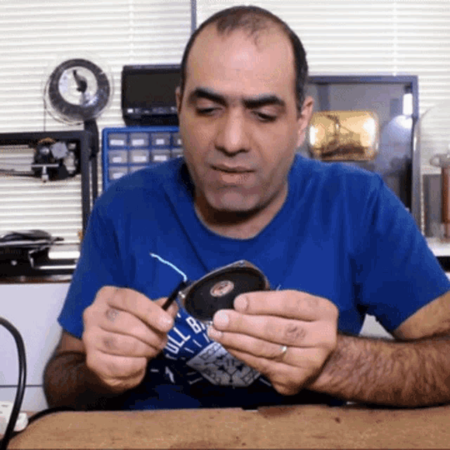
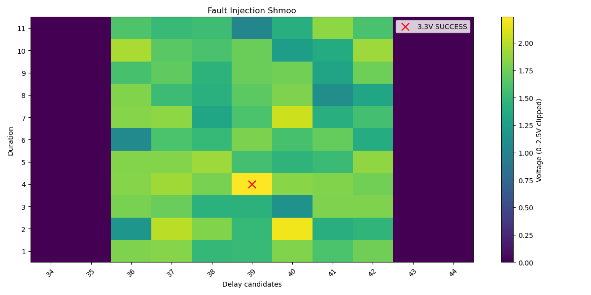

# Writeup GBHMM 2/3 : Fault Injection Glitching



## Description du challenge :

```
Malheureusement, le debug UART semble désactivé par le firmware lors du boot..
Votre objectif est de glitcher le CPU de la caméra pour obtenir un accès UART.
Attention, la réussite du glitch est parfois perturbée par des phénomènes physique (ainsi, des répétitions peuvent-être nécessaires).
```

## 1. Rappel : Fault Injectkwa ??

Je laisse Wikipédia expliquer à ma place, la définition est très bonne :

> "L'injection de faute consiste à utiliser une sonde électromagnétique reliée à un pulseur ou un laser générant une perturbation de l'ordre du temps de cycle du processeur (la nanoseconde)."
> [https://fr.wikipedia.org/wiki/Attaque_par_faute](https://fr.wikipedia.org/wiki/Attaque_par_faute)

Dans notre cas, on agit sur la tension d’alimentation (_voltage glitch_), mais dans il existe d'autres méthodes (sur l’horloge, la température, ou encore avec un laser directement sur le silicium).

L’objectif est de provoquer une erreur d’exécution contrôlée, par exemple :

- bypass d’un check de sécurité
- corruption d’un registre
- activation d’un mode debug

Dans ce challenge, on simule ce principe via un endpoint logiciel qui imite un comportement matériel : on contrôle donc l’alimentation électrique de la puce cible par le logiciel car on ne va pas s’amuser à débrancher/rebrancher la prise USB-C à la nanoseconde près :))

---

## Contexte du challenge

Sur la caméra précédemment analysée, on observe des pins de debug sur le PCB (pour plus de détails sur les interfaces de débug et en particulier l'UART : [https://www.youtube.com/watch?v=01mw0oTHwxg](https://www.youtube.com/watch?v=01mw0oTHwxg))

Le debug UART est désactivé par le firmware (par mesure de sécurité). C’est par exemple le cas sur les AirTags, où le JTAG est désactivé (très bonne vidéo sur le sujet, qui reprend la thématique du challenge sur un cas réel : [https://www.youtube.com/watch?v=_E0PWQvW-14](https://www.youtube.com/watch?v=_E0PWQvW-14)
On dispose d'un :
- multimètre virtuel
- outil de glitch logiciel (`glitch(pin, delay, duration)`)
- accès UART via `nc`

Le système ne répond pas toujours de manière déterministe : certains paramètres ne produisent un effet observable qu’avec une probabilité non nulle.

Le `delay` et la `duration` sont fixes car on part du principe que :

- l’instruction de désactivation de l’UART est exécutée toujours au même moment dans la chaîne de boot
- le device met toujours le même temps à exécuter les instructions de boot

Mais certains phénomènes physiques font que, même avec les bonnes valeurs, le glitch ne fonctionne pas à chaque fois (ici une probabilité de 0.4 a été choisie, de manière relativement arbitraire, mais cela permet aussi de complexifier le challenge).

Pour relier l’adaptateur UART, c’est assez simple et classique :

- TX <=> RX
- RX <=> TX
- GND <=> GND

Pas besoin d’alimenter la puce via l’adaptateur UART.

Pour le multimètre, on mesure `uart_tx` car on s’attend à ce que le device écrive un boot log.

- `vcc` est le pin que l’on glitch
- `uart_rx` n’a pas d’intérêt tant qu’on n’envoie pas de données (même si l’UART est à 3.3 V stable en idle)

---
## Étape 0 : Configuration du câblage et du multimètre

Avant de glitcher, il faut configurer le câblage PCB et le multimètre via l'API :

```python
requests.post(BASE_URL + "/wiring", json={
    "camera_rx": "uart_tx",
    "camera_tx": "uart_rx",
    "gnd": "gnd",
})

requests.post(BASE_URL + "/multimeter", json={
    "mode": "voltage",
    "red": "uart_tx",
    "black": "gnd",
})
```

Sans cette configuration, `get_pin_voltage('uart_tx')` retourne systématiquement `0.0` — le câblage incorrect et les sondes du multimètre mal placées sont vérifiés côté serveur.

---## Le glitch

La stratégie est la suivante : glitcher le device en l’alimentant électriquement (reboot à chaque fois), et changer les paramètres `delay` et `duration` jusqu’à trouver le moment où l’instruction de désactivation de l’UART est exécutée.

Pas de bruteforce en guessant, il faut comprendre ce que l’on fait.
### Étape 1 : trouver une fenêtre de delay

On commence par déterminer une fenêtre de bruteforce :

- on fixe une valeur de `duration`
- on fait varier `delay`
- on mesure la tension sur `uart_tx`

On script ça en Python :

```
def run(code):
	return requests.post(URL, json={"code": code}).json()["output"]

def measure(delay, duration, samples=5):
	values = []
	for s in range(samples):
		run(f"glitch(pin='vcc', delay={delay}, duration={duration})")
		v = float(run("get_pin_voltage('uart_tx')"))
		values.append(v)
	return values
```

Au début, le voltage est à 0.0 (normal, rien ne se passe) :

```
30 = [0.0, 0.0, 0.0, 0.0, 0.0, 0.0, 0.0, 0.0] (avg=0.0)
31 = [0.0, 0.0, 0.0, 0.0, 0.0, 0.0, 0.0, 0.0] (avg=0.0)
32 = [0.0, 0.0, 0.0, 0.0, 0.0, 0.0, 0.0, 0.0] (avg=0.0)
33 = [0.0, 0.0, 0.0, 0.0, 0.0, 0.0, 0.0, 0.0] (avg=0.0)
34 = [0.0, 0.0, 0.0, 0.0, 0.0, 0.0, 0.0, 0.0] (avg=0.0)
```

Puis on observe de l’activité (mais pas de 3.3 V stable) :

```
37 = [1.29, 0.84, 1.87, 1.46, 1.25, 0.87, 2.32, 1.57] (avg=1.43)
38 = [1.22, 2.31, 1.47, 1.74, 1.63, 0.93, 1.39, 1.23] (avg=1.49)
39 = [0.97, 0.98, 2.05, 1.3, 1.56, 2.22, 1.91, 1.3] (avg=1.54)
40 = [1.45, 1.28, 2.05, 1.15, 2.04, 0.97, 2.0, 0.88] (avg=1.48)
41 = [2.44, 0.9, 1.48, 1.53, 2.32, 2.24, 1.52, 2.33] (avg=1.84)
42 = [1.77, 0.87, 1.84, 2.21, 1.37, 1.66, 1.11, 2.42] (avg=1.66)
43 = [0.83, 1.4, 2.03, 2.45, 1.81, 2.35, 1.75, 1.24] (avg=1.73)
```

Et enfin, après la zone cible, plus rien :

```
44 = [0.0, 0.0, 0.0, 0.0, 0.0, 0.0, 0.0, 0.0] (avg=0.0)
```

On récupère donc les delays intéressants :

```
[*] candidates: [37, 38, 39, 40, 41, 42, 43]`
```

On fixe les delays candidats et on teste différentes durations.

On répète plusieurs fois (car probabiliste) :

```
d=40 dur=1 → [1.76, 1.18, 0.84, 0.89, 1.65, 0.92]
d=40 dur=2 → [2.32, 1.86, 1.71, 2.22, 2.07, 2.25]
d=40 dur=3 → [1.85, 1.25, 1.84, 0.89, 1.54, 1.27]
d=40 dur=4 → [3.3, 1.5, 1.47, 3.3, 3.3, 1.04]

[+] GLITCH SUCCESS
delay=40, duration=4
```

---

## Shmoo graph

Le _shmoo graph_ permet de visualiser la réponse du système selon :

- delay (axe X)
- duration (axe Y)
- voltage (couleur)

Le graph ci-dessous a été généré à partir des données d’une autre exécution du challenge et ne coïncide donc pas avec les valeurs de l’exemple ci-dessus :



---

> Une fois le glitch réussi, on peut récupérer le flag via l’UART :

```
nc localhost 1337
```
