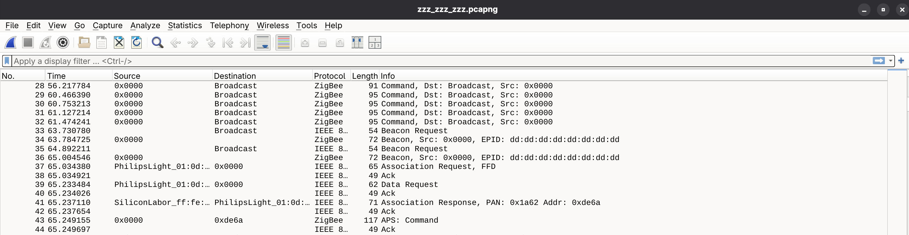
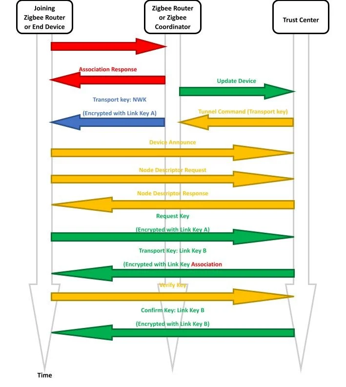
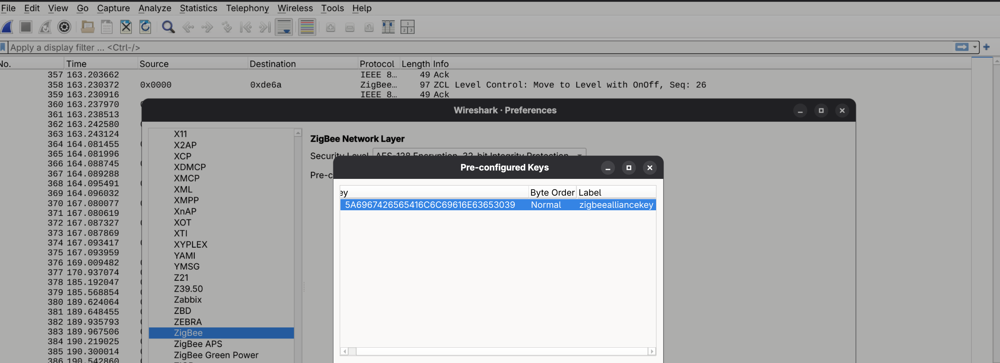
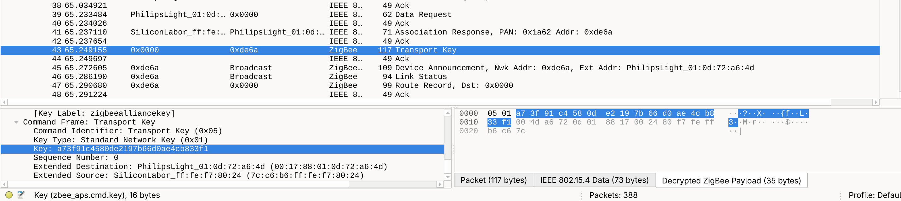
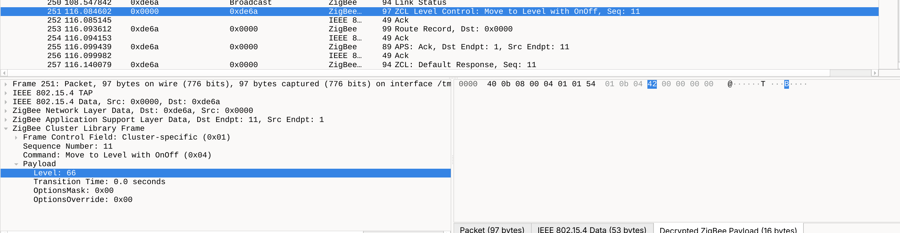
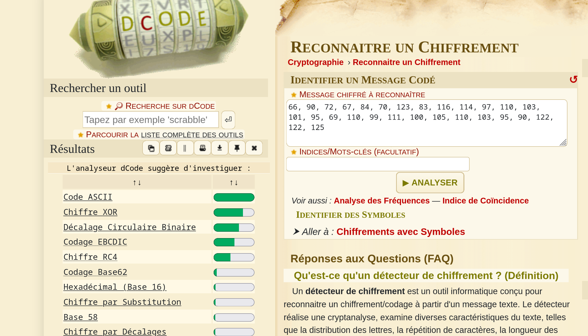
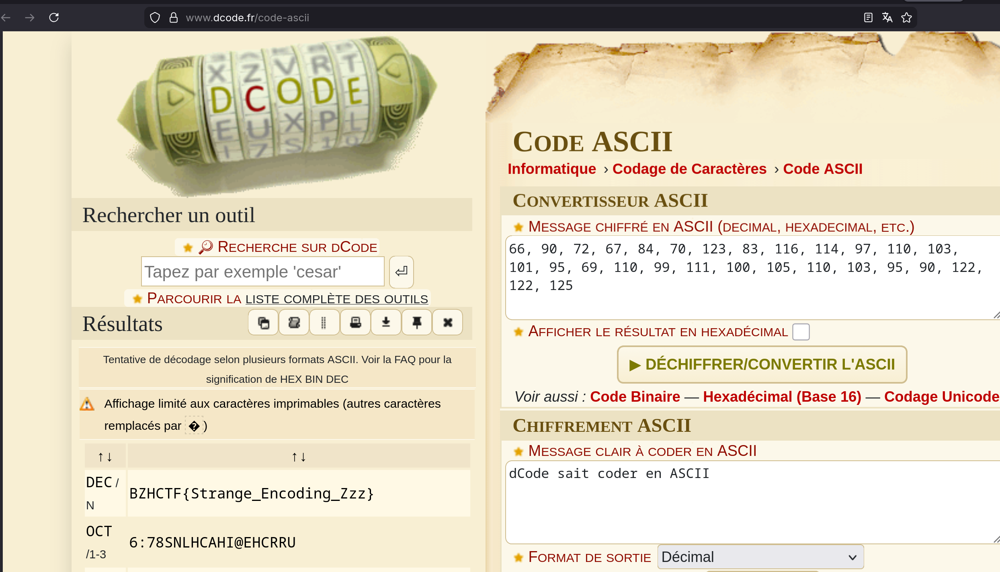

# Zzz zzz zzz


## Description du challenge

```
L'ampoule connectée de ma chambre se met à changer de luminosité toute seule depuis que j'ai fait la mise à jour du firmware.

Je suis peut-être fou… mais j'ai l'impression que l'ampoule essaie de me parler.

J'ai fait une capture du réseau domotique : aidez-moi à la déchiffrer et à décoder le message caché pour obtenir le flag.
```

---

## Analyse succincte du PCAP

On commence par ouvrir le fichier fourni (`.pcapng`) dans Wireshark.



On se rend rapidement compte qu'il s'agit d'une capture Zigbee grâce aux dissectors intégrés de Wireshark.

L'énoncé nous parle d'une ampoule et on peut observer `PhilipsLight` comme nom pour un des devices, cela semble correspondre. Le challenge nous demande ensuite de déchiffrer la capture afin de retrouver le message caché.

Commençons donc par déchiffrer cette capture. Pour cela, il faut être familier avec la méthode d'appairage Zigbee et la cryptographie associée.

---

## Rappels sur l'appairage Zigbee

Zigbee est un protocole de communication radio basé sur la norme IEEE 802.15.4, principalement utilisé dans les réseaux domotiques maillés (*mesh*).

Un réseau Zigbee est généralement composé de trois types d'équipements :

- les coordinateurs,
- les routeurs,
- les *end devices*.

Le coordinateur agit comme point central du réseau et gère notamment l'autorisation des nouveaux équipements.

Lorsqu'un nouvel équipement rejoint le réseau, le coordinateur doit lui transmettre la clé de chiffrement du réseau : la *network key*.

Cette clé est envoyée chiffrée grâce à une autre clé partagée appelée *link key*.

Le schéma ci-dessous résume le processus d'appairage Zigbee :



[Source : Granite River Labs](https://www.graniteriverlabs.com/en-us/technical-blog/zigbee-network-topology-device-process)

Il existe plusieurs méthodes sécurisées permettant au coordinateur et au device de se mettre d'accord sur une *link key* (par exemple via un *installation code* présent dans un QR code scanné depuis une application mobile).

Cependant, historiquement (et encore trop souvent aujourd'hui) de nombreux équipements Zigbee utilisent lors de la phase de commissioning une clé par défaut définie par la Zigbee Alliance :

```text
ZigBeeAlliance09
```

En hexadécimal :

```text
5A 69 67 42 65 65 41 6C 6C 69 61 6E 63 65 30 39
```

Cette clé a fuité depuis longtemps et constitue une faiblesse bien connue de Zigbee. Encore aujourd'hui, de nombreux équipements l'utilisent toujours : un bel exemple du célèbre *“The S in IoT stands for Security”*.

---

## Déchiffrement de la capture

Une rapide recherche permet donc de retrouver cette clé par défaut.

On peut ensuite l'importer dans Wireshark via :

```
Edit => Preferences => Protocols => ZigBee
```

Puis ajouter la clé dans les paramètres Zigbee du profil Wireshark.



Wireshark déchiffre alors automatiquement les paquets chiffrés avec cette clé, et notamment le paquet numéro `43`, qui attire notre attention :

```text
Transport Key
```

Ce paquet contient justement la *network key* envoyée par le coordinateur et chiffrée avec la *link key* par défaut.



Une fois cette *network key* récupérée, il devient possible de déchiffrer l'ensemble du trafic Zigbee de la capture.

---

## Analyse des messages Zigbee

On peut maintenant lire plus en détail les échanges entre le coordinateur et l'ampoule Philips.

L'énoncé parlait d'une ampoule dont la luminosité semblait envoyer un message codé. En observant les paquets déchiffrés, on remarque rapidement une suite de paquets revenant périodiquement :

```text
251 116.084602       0x0000 → 0xde6a       ZigBee HA 97 ZCL Level Control: Move to Level with OnOff, Seq: 11
```

```text
259 119.072497       0x0000 → 0xde6a       ZigBee HA 97 ZCL Level Control: Move to Level with OnOff, Seq: 12
```

```text
266 122.077725       0x0000 → 0xde6a       ZigBee HA 97 ZCL Level Control: Move to Level with OnOff, Seq: 13
```

Le `ZCL` dans ces paquets signifie *Zigbee Cluster Library*. Il s'agit de la bibliothèque standardisée définissant les échanges entre équipements Zigbee.

La commande `Move to Level with OnOff` correspond bien au changement de luminosité dans le cadre d'une ampoule.

La documentation Zigbee précise :

> “On receipt of this command, a device SHALL move from its current level to the value given in the Level field.”

Source :  
https://zigbeealliance.org/wp-content/uploads/2019/12/07-5123-06-zigbee-cluster-library-specification.pdf

Un autre post traitant spécifiquement des ampoules Philips Hue confirme également cette interprétation :

> “OnLevel provides a way to make sure the light comes on to a specific level.”

Source :  
https://community.smartthings.com/t/couple-questions-about-zigbee-commands-and-attributes-for-level-control/37140

---

## Extraction des valeurs de luminosité

En regardant le contenu de chacun des paquets contenant une commande `Move to Level with OnOff`, on retrouve dans le payload la valeur exacte de luminosité envoyée à l'ampoule :



Avec `tshark`, on peut extraire facilement toutes ces valeurs et les récupérer sous forme de liste :

```text
[66, 90, 72, 67, 84, 70, 123, 83, 116, 114, 97, 110, 103, 101, 95, 69, 110, 99, 111, 100, 105, 110, 103, 95, 90, 122, 122, 125]
```

Le réflexe CTF classique (si on balance pas tout à claude ou gpt sans lire ce qu'on fait) consiste alors à tester le mode reconnaître un chiffrement de dcode.



Dcode reconnaît effectivement de l'ASCII classique. On tente donc le décodage :


